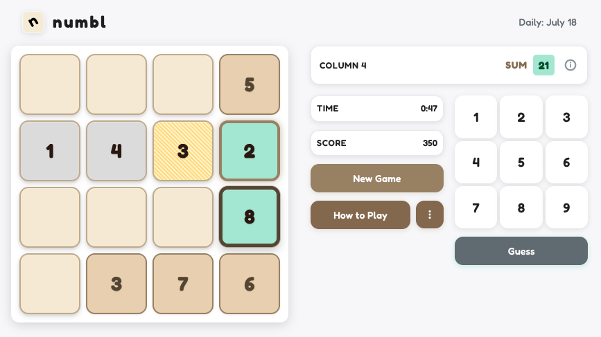

# numbl 🧮



A daily number puzzle game where you fill a 4x4 grid to match mathematical constraints. Think Wordle, but a Sudoku influence!

## 🎮 How to Play

**Goal**: Fill the 4x4 grid with numbers 1-9 so each row and column satisfies its constraint.

### Rules

- Use numbers 1-9 only (no zeros)
- Numbers can repeat across the grid, but not in the same row/column
- Some cells are pre-filled and can't be changed
- Complete rows/columns to check your answers

### Constraint Types

- **Sum**: Numbers must add up to target value
- **Odd/Even**: All numbers must be odd or even
- **Contains**: Must include specific numbers
- **Range**: All numbers within min/max range

### Controls

- **Mouse**: Click cells to select, number buttons to fill
- **Keyboard**: Arrow keys to navigate, number keys to fill, Enter to guess

## 🚀 Quick Start

### Play Online

[https://henryjburg.github.io/numbl](https://henryjburg.github.io/numbl)

### Run Locally

```bash
git clone https://github.com/henryjburg/numbl.git
cd numbl
npm install
npm start
```

## 🎯 Features

- Daily puzzles with unique constraints
- Color-coded feedback system
- Timer and scoring
- Share results
- Responsive design
- Keyboard shortcuts

---

© 2025 Henry Burgess
